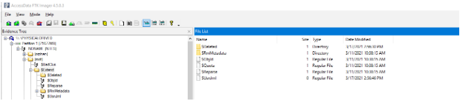
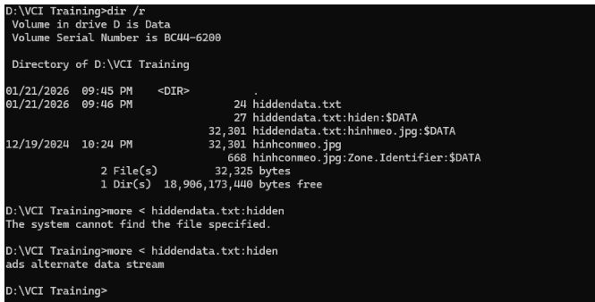

Ở các bài viết trước, chúng ta đã "mổ xẻ" quá trình khởi động và đọc hiểu cấu trúc phân vùng ổ cứng ở mức vật lý. Nhưng khi hệ điều hành đã lên, làm sao nó biết tệp tin `malware.exe` nằm ở đâu giữa hàng tỷ byte dữ liệu hỗn độn? Hôm nay, chúng ta sẽ bước vào thế giới của Hệ thống tệp (File System) – người quản lý kho vĩ đại của hệ điều hành, và khám phá những góc khuất mà hacker thường lợi dụng để ẩn mình.

## 1. Hệ thống tệp (File System) thực chất là gì?

Nếu bạn tưởng tượng ổ cứng vật lý là một cái kho chứa khổng lồ trống rỗng, thì Tệp (File) chính là những thùng hàng chứa đồ đạc. Vậy Hệ thống tệp (File System) là gì? Nó chính là thủ kho và bộ sổ sách quản lý. Thủ kho sẽ quyết định thùng hàng này đặt ở kệ nào, ghi chú vào sổ để khi bạn cần, họ có thể lấy ra ngay lập tức.

Về mặt kỹ thuật, đĩa vật lý chia thành các Sector (đơn vị lưu trữ nhỏ nhất, thường là 512 byte). Tuy nhiên, để quản lý dễ dàng hơn, hệ điều hành gom các Sector lại thành các Cluster (Liên cung). Một Cluster là "đơn vị thuê đất" nhỏ nhất; một tệp dù chỉ chứa 1 chữ cái cũng sẽ được cấp ít nhất 1 Cluster.

Nếu không có Hệ thống tệp, dữ liệu trên ổ cứng sẽ chỉ là một khối bit khổng lồ không có điểm bắt đầu hay kết thúc.

## 2. FAT32: Kẻ lỗi thời nhưng không thể thay thế

FAT32 (File Allocation Table 32-bit) ra đời từ thời Windows 95 để thay thế cho FAT16, sử dụng 28-bit để đánh số Cluster. Mặc dù đã cũ, nó vẫn được dùng rất phổ biến trên USB, thẻ nhớ máy ảnh và các thiết bị IoT vì tính tương thích cao với mọi hệ điều hành.

### 2.1 Kiến trúc cốt lõi của FAT32

Một phân vùng FAT32 được chia làm 3 vùng chính:
- **Reserved Region (Vùng lưu trữ):** Chứa Boot Sector (Sector 0) lưu các tham số cấu hình BIOS (BPB) và FSInfo (Sector 1) lưu số lượng Cluster còn trống.
- **FAT Region (Vùng bảng FAT):** Cuốn "mục lục" khổng lồ của ổ đĩa. Nó chứa Bảng cấp phát tệp (thường có FAT1 và bản dự phòng FAT2) ghi lại tệp nào nằm ở Cluster nào và Cluster tiếp theo là gì.
- **Data Region (Vùng dữ liệu):** Nơi chứa nội dung thực sự của các tệp và Thư mục gốc.

**Cơ chế nối xích (Cluster Chain):** Khi bạn lưu một file nặng 10KB vào đĩa có Cluster 4KB, file sẽ bị cắt làm 3 phần. Bảng FAT sẽ ghi lại mối liên kết: "Cluster A trỏ tới B", "Cluster B trỏ tới C", và "Cluster C là kết thúc (EOF)".

### 2.2 Những giới hạn "huyền thoại" và Dấu vết Forensics

Điểm yếu chí mạng của FAT32 là nó chỉ hỗ trợ kích thước file tối đa 4GB và Windows mặc định chỉ cho tạo phân vùng tối đa 32GB. Ngoài ra, nó không hỗ trợ tính năng phân quyền bảo mật (như NTFS), ai cắm USB vào cũng có thể đọc được file.

> **Góc nhìn Forensics:** Khi một tệp bị xóa trên FAT32, hệ thống không hề xóa dữ liệu thực sự. Nó chỉ đổi ký tự đầu tiên của tên tệp thành mã Hex `0xE5` để báo hiệu rằng vùng nhớ đó đã "được giải phóng". Bằng các công cụ chuyên dụng (như Autopsy), SOC Analyst hoàn toàn có thể khôi phục lại (Carving) các tệp tin mã độc đã bị hacker vội vàng xóa đi.

## 3. NTFS: Kẻ kế thừa mạnh mẽ và phức tạp

Để đáp ứng nhu cầu bảo mật và lưu trữ khổng lồ, Windows hiện đại chuyển sang dùng NTFS (New Technology File System). NTFS vượt qua giới hạn 4GB, hỗ trợ phân quyền truy cập (ACLs), nén file và đặc biệt là khả năng tự phục hồi nhờ tính năng Nhật ký (Journaling).

Cấu trúc NTFS bao gồm: Boot Sector, MFT (Master File Table), MFT Mirror (bản sao dự phòng), và Vùng dữ liệu (Data Area).

### 3.1 "Trái tim" MFT (Master File Table)

MFT là một tệp đặc biệt có tên `$MFT`. Trong NTFS, mọi thứ đều là một tệp, kể cả chính hệ thống tệp! Mỗi tệp, thư mục trên ổ đĩa đều có một bản ghi (Record) tương ứng bên trong MFT.

Bản ghi MFT chứa siêu dữ liệu cực kỳ chi tiết: Tên tệp, quyền truy cập, dấu thời gian (MACB - Modified, Accessed, Created, Birth), và con trỏ trỏ đến vị trí Cluster chứa dữ liệu thực sự. Nếu một tệp có kích thước cực nhỏ, nội dung của nó thậm chí được lưu trực tiếp ngay bên trong bản ghi MFT (Resident Data)!

### 3.2 "Camera an ninh" Journaling ($LogFile và $USNJrnl)

Đây là "mỏ vàng" cho Blue Team khi điều tra dấu vết mã độc:
- **`$LogFile`:** Ghi lại mọi thay đổi siêu dữ liệu (tạo, xóa, sửa tệp) trước khi chúng được ghi xuống đĩa, giúp hệ thống khôi phục tính nhất quán nếu bị sập nguồn.
- **`$USNJrnl` (Update Sequence Number Journal):** Nằm trong thư mục `$Extend`, nó cung cấp bản ghi lịch sử mọi hoạt động của tệp tin. Nếu mã độc tạo một file rồi xóa ngay lập tức để phi tang, `$USNJrnl` (cụ thể là luồng dữ liệu `$J`) vẫn lưu lại mã sự kiện `USN_REASON_FILE_CREATE` và `USN_REASON_FILE_DELETE`.



## 4. Alternate Data Streams (ADS) - Kỹ thuật ẩn mình của Mã độc

Cuối cùng, chúng ta sẽ đề cập đến góc khuất nguy hiểm nhất của NTFS: Alternate Data Streams (ADS).

Theo thiết kế ban đầu, ADS là một tính năng ẩn giúp một tệp tin NTFS có thể chứa nhiều luồng dữ liệu (streams) khác nhau. Luồng chính chứa nội dung mà chúng ta nhìn thấy, trong khi luồng phụ chứa các siêu dữ liệu. Điển hình nhất, Windows dùng luồng `Zone.Identifier` để đánh dấu các tệp được tải về từ Internet nhằm hiển thị cảnh báo bảo mật.

**Kỹ thuật giấu mã độc (Hide Payload):** Hacker nhận ra rằng luồng phụ của ADS có thể chứa một lượng dữ liệu bất kỳ mà dung lượng file hiển thị bên ngoài trong File Explorer không hề thay đổi. Chúng có thể đính kèm một mã độc nặng hàng chục Megabyte vào đằng sau một tệp `.txt` vô hại nặng vài Kilobyte!

### 4.1 Thực hành tạo và phát hiện ADS

Bạn có thể tự tay tạo một luồng ADS bằng lệnh Command Prompt rất đơn giản:

```cmd
:: Nhét dòng chữ "hiden" vào luồng phụ mang tên "hiden" đằng sau tệp hiddendata.txt
notepad hiddendata.txt:hiden

:: Nhét toàn bộ nội dung của tệp hinhconmeo.jpg vào luồng ADS của file hiddendata.txt
type hinhconmeo.jpg > hiddendata.txt:hinhmeo.jpg
```

Để phát hiện mã độc đang lẩn trốn trong ADS, lệnh `dir` thông thường sẽ hoàn toàn vô dụng. Bạn bắt buộc phải thêm tham số `/r`:

```cmd
:: Kiểm tra các tệp có chứa luồng dữ liệu ẩn (ADS)
dir /r
```

Khi chạy lệnh này, bạn sẽ thấy kết quả hiển thị dạng `<Tên_tệp>:<Tên_luồng>:$DATA` (ví dụ: `hiddendata.txt:hiden:$DATA`), bóc trần hoàn toàn vị trí ẩn náu của tệp tin độc hại.


---

*Tóm lại, hiểu thấu bề mặt cấu trúc File System không chỉ giúp chúng ta biết máy tính lưu trữ dữ liệu ra sao, mà còn cung cấp bộ công cụ tối thượng để săn lùng các đoạn mã độc cố tình bị xóa hoặc bị che giấu tinh vi. Trong bài viết tiếp theo, chúng sẽ chuyển hướng sang một khu vực nhạy cảm không kém: Giải phẫu "Bộ não" cấu hình Windows Registry và các điểm neo duy trì sự hiện diện của Malware. Các bạn nhớ đón đọc nhé!*
