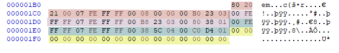
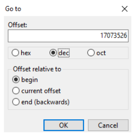
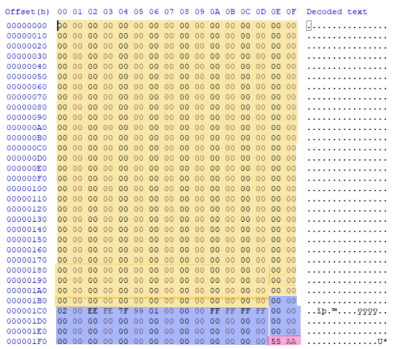
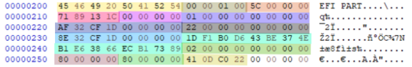

Ở bài viết trước, chúng ta đã đi qua bức tranh tổng thể của quá trình khởi động. Nhưng đối với một nhà phân tích SOC hay chuyên gia điều tra số (Forensics), "nhìn thấy" hệ điều hành khởi động là chưa đủ. Chúng ta cần phải nhìn thấu vào từng Byte, từng khối Hex trên mặt đĩa vật lý để biết hacker đang giấu gì. Hôm nay, hãy cùng mình mở công cụ HxD lên và đi sâu vào giải phẫu MBR, GPT, đồng thời thực hành một kịch bản "cứu hộ" kinh điển: Khôi phục MBR bị mã độc phá hủy.

## 1. MBR (Master Boot Record) dưới lăng kính Hex

> 💡 **Nhắc lại kiến thức:** Ở bài viết trước, chúng ta đã tìm hiểu về cấu trúc 512 byte chật chội của MBR (gồm 446 byte Bootstrap, 64 byte Bảng phân vùng và 2 byte Chữ ký). Nếu bạn chưa nắm rõ phần này, hãy xem lại bài viết **[Khởi nguồn hệ thống - Windows Booting](/p/windows-booting/)** trước khi đi tiếp nhé!




### 1.1 Giải mã 16 Byte của Bảng phân vùng (Partition Table)

Nhìn vào 16 byte của một phân vùng trong HxD, làm sao ta đọc hiểu được nó? Hãy lấy ví dụ một chuỗi Hex chuẩn của phân vùng khởi động:
```text
80 20 21 00 07 FE FF FF 00 08 00 00 00 B0 23 03
```

Đây là cách chúng ta hiểu nó:
- **Chỉ báo khởi động (Byte 1 - 80):** Giá trị `80` nghĩa là phân vùng này có thể khởi động được (Active/Bootable). Nếu là `00` thì đây chỉ là ổ chứa dữ liệu bình thường.
- **Địa chỉ CHS bắt đầu (Byte 2,3,4 - 20 21 00):** Tọa độ vật lý (Cylinder-Head-Sector) bắt đầu của đĩa. Ngày nay, thông số này không còn quá quan trọng.
- **Mã hệ thống tệp (Byte 5 - 07):** Giá trị `07` khẳng định đây là phân vùng định dạng NTFS.
- **Địa chỉ CHS kết thúc (Byte 6,7,8 - FE FF FF):** Tọa độ vật lý kết thúc của phân vùng.
- **Địa chỉ LBA bắt đầu (Byte 9,10,11,12 - 00 08 00 00):** Tọa độ logic bắt đầu. Do Windows dùng định dạng Little-Endian (byte thấp đứng trước), ta phải đọc ngược lại thành `00 00 08 00`. Đổi chuỗi Hex `0800` ra hệ thập phân ta được 2048. Nhân với 512 byte/sector, ta biết phân vùng này bắt đầu tại Offset `1048576` trên ổ cứng.
- **Kích thước phân vùng (Byte 13,14,15,16 - 00 B0 23 03):** Đọc ngược Little-Endian thành `03 23 B0 00`. Chuyển sang thập phân là 52,670,464 sectors. Nhân với 512 byte, ta tính ra phân vùng này nặng khoảng 26,967,277,568 bytes (xấp xỉ 26.9 GB).

**Mẹo thực hành:** Trong HxD, bạn có thể bấm `Ctrl + G` (Go to), nhập giá trị thập phân `1048576` vào ô Offset để nhảy thẳng đến vị trí bắt đầu của hệ điều hành.



## 2. Thử khôi phục MBR bị xóa

**Kịch bản sự cố:** Máy chủ cơ sở dữ liệu quan trọng đột nhiên không thể khởi động. Điều tra cho thấy một nhân viên đã vô tình mở email chứa mã độc. Hệ thống bị ép khởi động lại và báo lỗi "Operating System not found". Mọi nghi ngờ đổ dồn vào một Bootkit đã phá hủy MBR.

**Tiến hành phân tích:** Khi load file Image của ổ cứng nạn nhân vào HxD và soi vào Sector 0, ta phát hiện một điểm chí mạng: Ở Offset `000001F0` (cuối Sector 0), thay vì kết thúc bằng chữ ký chuẩn `55 AA`, nó lại chứa toàn `00 00`. Không có chữ ký này, BIOS không công nhận đây là một ổ đĩa hợp lệ!

**Cách khôi phục:**
1. **Dò tìm VBR (Volume Boot Record):** Dù MBR bị xóa, nhưng phân vùng chứa hệ điều hành vẫn còn. Theo tiêu chuẩn mặc định của Windows, phân vùng đầu tiên (LBA bắt đầu) thường nằm ở Sector 2048.
2. **Xác nhận:** Di chuyển tới Sector 2048. Nếu ta nhìn thấy chuỗi chữ ký NTFS hoặc thông điệp lỗi dạng `A disk read error occurred... NTLDR is missing`, thì xin chúc mừng, dữ liệu chưa hề mất.
3. **Tái tạo:** Bằng các công cụ chuyên dụng (như Bootrec.exe hoặc TestDisk), ta có thể ghi lại 446 byte mã khởi động và chèn lại chữ ký `55 AA` vào vị trí cũ, cứu sống hoàn toàn máy chủ mà không làm mất một bit dữ liệu nào.


## 3. Sự tiến hóa mang tên GPT (GUID Partition Table)

MBR có giới hạn chí mạng: Nó chỉ hỗ trợ tối đa 4 phân vùng và không thể quản lý dung lượng đĩa quá 2 Terabytes. Để đáp ứng các server khổng lồ, UEFI và GPT (hỗ trợ lên đến 9 Zettabyte, 128 phân vùng) ra đời.

Để đảm bảo tương thích ngược và tránh việc các công cụ định dạng cũ tưởng nhầm đĩa GPT là đĩa trắng rồi "vô tình" ghi đè, GPT tạo ra một lớp giáp gọi là Protective MBR (MBR bảo vệ).

### 3.1 MBR Bảo vệ (Protective MBR)

Nó vẫn nằm ở Sector 0. Cấu trúc của nó y hệt MBR cũ, chứa đủ `55 AA` ở cuối, nhưng bảng phân vùng của nó chỉ khai báo đúng 1 phân vùng duy nhất, chiếm toàn bộ đĩa đệm với mã loại (Type) là `EE`. Mã `EE` là tín hiệu để các hệ thống cũ lùi lại: "Đây là đĩa GPT, đừng có đụng vào!"



## 4. Giải phẫu GPT Header và Partition Entry Array

Với GPT, mọi thứ thực sự bắt đầu từ Sector 1 và Sector 2.

### 4.1 GPT Header (Sector 1)



GPT Header chiếm 92 byte đầu tiên của Sector 1. Khi nhìn vào Hex, bạn sẽ thấy nó cực kỳ rõ ràng:
- **Chữ ký (8 Byte đầu):** Luôn là `45 46 49 20 50 41 52 54` (Dịch ra mã ASCII là "EFI PART").
- **Bảo vệ toàn vẹn (CRC32):** GPT lưu mã Hash CRC32 của chính nó. Nếu mã độc sửa đổi dù chỉ 1 byte trong Header, CRC32 sẽ thay đổi, UEFI sẽ lập tức phát hiện và báo lỗi.
- **LBA dự phòng (Backup LBA):** Một tính năng tuyệt vời của GPT! Nó khai báo vị trí của một bản sao lưu GPT Header ở tít tận Sector cuối cùng của ổ đĩa. Nếu Header chính bị mã độc phá, ta vẫn có thể dùng bản Backup để hồi sinh hệ thống.

### 4.2 Partition Entry Array (Mảng phân vùng - Sector 2 trở đi)

GPT hỗ trợ quản lý tới 128 phân vùng, mỗi phân vùng được cấp hẳn 128 Byte để lưu trữ thông tin (thay vì 16 byte chật hẹp như MBR).

**Một Partition Entry trong GPT chứa gì?**
- **GUID Loại Phân vùng (16 byte):** Định danh loại phân vùng. Đặc biệt, nó được lưu dưới dạng Mixed-Endian (Trộn lẫn giữa Little-Endian và Big-Endian). 3 khối byte đầu phải đọc ngược, trong khi 2 khối sau giữ nguyên.
- **GUID Phân vùng duy nhất (16 byte):** Căn cước công dân (ID) riêng biệt cho từng phân vùng đĩa.
- **LBA Bắt đầu & Kết thúc (16 byte):** Vị trí chính xác của phân vùng.
- **Tên Phân vùng (72 byte):** Được lưu dưới định dạng chuỗi UTF-16. Nếu ném đoạn Hex này vào tool convert, ta sẽ thấy rõ ràng các tên như "Basic data partition" hay "EFI system partition".

Đặc biệt, hệ điều hành sẽ không boot từ một phân vùng chung chung nữa. Mọi file Bootloader (các file `.efi`) đều phải được đặt gọn gàng trong một khu vực riêng gọi là Phân vùng hệ thống EFI (ESP). Mã độc muốn can thiệp quá trình Boot trên máy UEFI buộc phải tìm cách chui lọt qua Secure Boot và ghi dữ liệu vào phân vùng ESP này.

---

*Việc đọc hiểu mã Hex của ổ cứng giúp các SOC và Forensics không bị phụ thuộc vào các công cụ tự động. Khi hệ thống sụp đổ hoặc mã độc ẩn mình dưới lớp vỏ bọc, chính những byte dữ liệu thô này sẽ nói cho chúng ta biết sự thật. Ở bài viết tới, chúng ta sẽ bắt tay vào phân tích sâu hơn hệ thống tệp NTFS và kỹ thuật giấu file bằng Alternate Data Streams. Hẹn gặp lại các bạn!*
