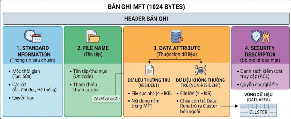

Chào mừng các bạn quay trở lại với Series Giải phẫu Windows OS & SOC Analytics! Ở bài viết trước, chúng ta đã hiểu được bức tranh tổng thể về File System và "chiêu trò" giấu mã độc qua Alternate Data Streams (ADS).Hôm nay, chúng ta sẽ cầm kính lúp pháp y (Forensics) để soi vào tận cùng cấu trúc NTFS, bóc tách cuốn sổ cái MFT và trích xuất các "camera an ninh" ngầm của hệ thống.

## 1. Kiến trúc tổng thể của NTFS: Đường đi của một tệp tin

Để hiểu NTFS, trước tiên ta cần nắm được cách nó phân chia ổ đĩa. NTFS chia đĩa thành các Cluster (thường là 4KB). Ngay cả khi một file chỉ nặng 2KB, nó vẫn chiếm trọn 1 Cluster 4KB, phần dư thừa đó (Slack Space) không cho file khác dùng. Điều này giúp NTFS tăng tốc độ ghi đọc theo khối lớn và hỗ trợ điều tra dấu vết mã độc.

Cấu trúc cốt lõi của một phân vùng NTFS bao gồm 4 phần chính:
- **Boot Sector:** Nằm ở phần đầu phân vùng, chứa Jump code để boot và vị trí của MFT.
- **MFT (Master File Table):** Cuốn sổ cái lưu trữ mọi thông tin.
- **MFT Mirror ($MFTMirr):** Bản sao lưu một phần của MFT để phục hồi khi lỗi.
- **Data Area:** Khu vực chứa nội dung dữ liệu thực sự của file.

> **Luồng hoạt động khi bạn mở một tệp:** Hệ thống đọc Boot Sector -> Xác định vị trí MFT -> Đọc bản ghi (Record) của file trong MFT -> Tìm ra Cluster chứa dữ liệu -> Lấy dữ liệu từ Data Area.

## 2. Bóc tách "Trái tim" MFT (Master File Table)

Trong NTFS, mọi thứ đều là một tệp, kể cả chính hệ thống tệp. MFT thực chất là một tệp đặc biệt có tên `$MFT`. Cuốn sổ cái này được chia thành hàng nghìn bản ghi (MFT Records) có kích thước cố định. Mỗi tệp tin hoặc thư mục trên máy tính của bạn đều tương ứng với đúng 1 Record bên trong `$MFT`.

### 2.1 Giải phẫu một MFT Record

Một bản ghi MFT chứa siêu dữ liệu (Metadata) cực kỳ chi tiết, bao gồm:
- **Standard Information (Thông tin tiêu chuẩn):** Chứa các dấu thời gian (Timestamps), quyền hạn, và các cờ như Read-only, Hidden, System.
- **File Name:** Tên của tệp hoặc thư mục.
- **Data Attribute (Thuộc tính dữ liệu):** Đây là phần thú vị nhất. Nếu file của bạn cực nhỏ (dưới vài trăm byte), NTFS sẽ nhét thẳng nội dung của file đó vào bên trong MFT Record (gọi là Resident Data). Nếu file lớn, phần này sẽ chứa danh sách các con trỏ (Data Runs) trỏ ra các Cluster ngoài Data Area (gọi là Non-Resident Data).
- **Security Descriptor:** Chứa danh sách kiểm soát truy cập (ACL) quy định ai được phép đọc/ghi file.



### 2.2 Góc nhìn Điều tra số

MFT là "mỏ vàng" vì những lý do sau:
- **Cờ In Use:** Xác định xem bản ghi này đang chứa một file hoạt động hay file đã bị xóa. Khi bạn xóa một file, dữ liệu trên đĩa chưa mất đi, NTFS chỉ đổi cờ In Use thành "chưa sử dụng". Do đó, các tệp bị xóa vẫn tồn tại bản ghi trong MFT, hỗ trợ việc khôi phục dữ liệu (Carving).
- **Số thứ tự (Sequence Number):** Bộ đếm tăng lên khi một bản ghi MFT được sử dụng lại cho file khác, giúp phân biệt file cũ và mới trên cùng một mục nhập.
- **Phân tích Dòng thời gian (Timeline):** MFT lưu trọn bộ 4 mốc thời gian MACB: Modified (Sửa đổi nội dung), Accessed (Truy cập cuối), Created (Tạo lập), và MFT Record Modified (Sửa đổi siêu dữ liệu). Đây là bằng chứng thép để tái tạo trình tự sự kiện của mã độc.

Bạn có thể dùng công cụ `MFTECmd.exe` của Eric Zimmerman để trích xuất `$MFT` ra file CSV và đọc bằng Timeline Explorer:
```cmd
:: Lệnh trích xuất và phân tích file $MFT
MFTECmd.exe -f C:\Evidence\$MFT --csv C:\Evidence --csvf MFT_record.csv
```

## 3. "Camera an ninh" của NTFS: $LogFile và USN Journal

Khi mã độc hoạt động, nó thường tạo file, ghi dữ liệu, rồi xóa ngay lập tức để phi tang dấu vết. Tuy nhiên, mọi hành động này đều bị hai "camera an ninh" của NTFS ghi lại trọn vẹn.

### 3.1 $LogFile (Nhật ký giao dịch)

`$LogFile` là một tệp siêu dữ liệu đặc biệt ghi lại mọi thay đổi (tạo, xóa, sửa tệp) trước khi chúng được ghi chính thức xuống đĩa. Chức năng gốc của nó là để hệ thống có thể "phát lại" (replay) các giao dịch và khôi phục tính nhất quán nếu máy tính bị sập nguồn đột ngột.

### 3.2 $USNJrnl (Update Sequence Number Journal)

Nếu `$LogFile` phục vụ cho hệ thống, thì USN Journal là bản ghi lịch sử tuyệt vời dành cho các dịch vụ theo dõi và giám sát. Nó nằm ẩn trong thư mục `$Extend\$UsnJrnl` ở thư mục gốc.

Đặc biệt, `$USNJrnl` bao gồm thành phần chính là `$J`, nơi lưu trữ các bản ghi thay đổi thực tế. Đáng chú ý, `$J` được Windows triển khai dưới dạng một luồng dữ liệu ẩn Alternate Data Stream (ADS) – chính là kỹ thuật chúng ta đã phân tích ở bài số 4!

Khi phân tích file `$J` (bằng `MFTECmd`), chúng ta sẽ thấy các mã sự kiện (Update Reasons) "tố cáo" mã độc:
- `USN_REASON_FILE_CREATE`: Tệp mã độc mới được tạo.
- `USN_REASON_DATA_OVERWRITE`: Dữ liệu trong tệp đã bị ghi đè.
- `USN_REASON_FILE_DELETE`: Tệp mã độc vừa tự xóa chính nó.
- `USN_REASON_RENAME_OLD_NAME`: Tệp tin bị đổi tên (thường thấy trong các vụ tấn công Ransomware đổi đuôi file).


## 4. Khám phá góc khuất $I30 (NTFS Index Allocation)

Để truy tìm dấu vết của các tệp tin đã bị xóa bốc hơi hoàn toàn khỏi MFT, các chuyên gia Forensics sẽ tìm đến một thuộc tính ẩn khác gọi là `$I30`.

Thuộc tính `$I30` là một chỉ mục (Index) thư mục, có nhiệm vụ duy trì cấu trúc sắp xếp các tệp và thư mục con bên trong một ổ đĩa NTFS.

**Góc nhìn Forensics:** Khi một tệp bị xóa, đổi tên hoặc di chuyển sang thư mục khác, tên của tệp đó sẽ bị gạch bỏ khỏi chỉ mục hoạt động của `$I30`. Tuy nhiên, dữ liệu văn bản chứa tên tệp đó vẫn còn sót lại trong vùng không gian trống (Slack Space) của tệp `$I30` cho đến khi bị ghi đè. Bằng cách quét vùng không gian Slack Space này, chúng ta có thể chứng minh được sự tồn tại trong quá khứ của một công cụ hack hoặc một tệp tin dữ liệu nhạy cảm mà kẻ tấn công tưởng chừng đã xóa sạch không tì vết.

---

*Qua bài viết này, chúng ta đã đi sâu vào tận cùng các khối cấu trúc tĩnh của hệ thống tệp NTFS. Bằng cách kết hợp phân tích MFT, USN Journal và chỉ mục $I30, không một hành vi tạo, xóa hay sửa đổi tệp tin nào của mã độc có thể qua mắt được bạn. Ở bài viết tiếp theo, chúng sẽ chuyển sang một lĩnh vực đầy tính động và cực kỳ hấp dẫn: Giải phẫu Windows Registry và các điểm neo duy trì sự hiện diện của Malware. Đừng bỏ lỡ nhé!*
