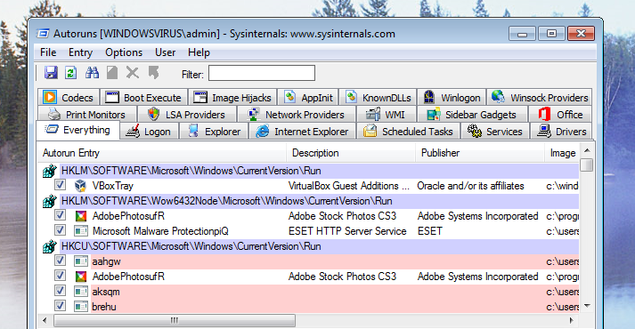

Chào mừng các bạn tiếp tục với Series Giải phẫu Windows OS & SOC Analytics! Ở bài viết trước, chúng ta đã hiểu cơ chế hoạt động của Registry. Hôm nay, chúng ta sẽ bước vào một cuộc chiến thực sự: Săn lùng Malware. Một trong những mục tiêu tối thượng của mã độc sau khi xâm nhập thành công là Duy trì sự hiện diện (Persistence) - đảm bảo rằng dù người dùng có tắt máy hay khởi động lại, mã độc vẫn sẽ tự động kích hoạt. Nơi ẩn nấp lý tưởng nhất chính là Registry. Hãy cùng trang bị "vũ khí" PowerShell Autoruns để bóc trần những điểm neo này!

## 1. Kỹ thuật "Cắm chốt" kinh điển: Auto Run Keys

Hầu hết các phần mềm độc hại, từ cơ bản đến phức tạp, đều lợi dụng các khóa tự khởi động (Auto Run) do Microsoft thiết kế để kích hoạt cùng hệ thống. Các khóa này được chia theo cấp độ phân quyền:

- **Mức độ người dùng (User Level):** `HKCU\Software\Microsoft\Windows\CurrentVersion\Run`. Khóa này chỉ chạy mã độc khi người dùng hiện tại đăng nhập và không yêu cầu quyền Admin để ghi dữ liệu.
- **Mức độ hệ thống (Machine Level):** `HKLM\SOFTWARE\Microsoft\Windows\CurrentVersion\Run`. Khóa này chạy cho mọi người dùng trên máy nhưng bắt buộc mã độc phải có quyền Administrator hoặc SYSTEM mới có thể ghi vào đây. Việc mã độc ghi thành công vào khóa này chứng tỏ hệ thống đã bị leo thang đặc quyền.
- **Khóa "Dùng một lần" (RunOnce):** Tương tự như Run, nhưng hệ điều hành sẽ tự động xóa giá trị này ngay sau khi thực thi. Malware tinh vi thường dùng RunOnce để thực hiện các tập lệnh dọn dẹp dấu vết hoặc cài đặt sâu hơn vào hệ thống.

> **Góc nhìn SOC:** Khi mã độc ghi đè hoặc tạo mới giá trị thông qua các API như `RegSetValueEx`, Windows sẽ ghi nhận sự kiện với Event ID 4657 (A registry value was modified), trong khi Sysmon sẽ ghi nhận Event ID 13 (Registry Value Set). Riêng với khóa RunOnce, bạn sẽ thấy log nổ ra 2 lần (một lần lúc tạo và một lần lúc Windows tự xóa), tương ứng với Sysmon ID 13 và Sysmon ID 12 (Object Deleted).


## 2. Kỹ thuật ăn bám tiến trình hệ thống: Winlogon & Userinit

Thay vì tạo ra một khóa Registry mới dễ bị phát hiện, những kẻ tấn công khôn ngoan hơn sẽ "ký sinh" vào các tiến trình đăng nhập cốt lõi của Windows là Winlogon.

Hacker thường nhắm vào hai đường dẫn sau tại `HKLM\SOFTWARE\Microsoft\Windows NT\CurrentVersion\Winlogon`:

### 2.1 Ký sinh qua Userinit

Mặc định, giá trị của khóa Userinit chỉ đơn giản là `userinit.exe`. Tuy nhiên, khóa này có một tính năng đặc biệt (Comma-separated) cho phép nối nhiều đường dẫn với nhau bằng dấu phẩy. Hacker chỉ cần âm thầm chèn thêm một đoạn như `userinit.exe, C:\Users\Administrator\AppData\Local\Temp\789a.bat`. Kết quả là hệ thống sẽ tự động "rước" mã độc vào máy một cách hoàn toàn hợp lệ ngay sau khi người dùng nhập mật khẩu.

### 2.2 Đánh tráo giao diện (Shell)

Khóa Shell có nhiệm vụ gọi giao diện màn hình làm việc (mặc định là `explorer.exe`). Kẻ tấn công có thể thay thế hoàn toàn `explorer.exe` bằng mã độc của chúng, hoặc nối thêm như `explorer.exe, C:\windows\temp\malware.exe`.

## 3. Bóng ma "Cửa sau": Image File Execution Options (IFEO)

IFEO (`HKLM\SOFTWARE\Microsoft\Windows NT\CurrentVersion\Image File Execution Options\`) vốn là một tính năng được Microsoft thiết kế để các nhà phát triển gỡ lỗi (debug) ứng dụng của họ. Nhưng trong tay Hacker, IFEO biến thành công cụ leo thang đặc quyền và duy trì sự hiện diện cực kỳ đáng sợ.

**Kịch bản tấn công Sticky Keys khét tiếng:** Hacker sẽ tạo một khóa con mang tên `sethc.exe` (chương trình phím dính - Sticky Keys hiện lên khi bạn bấm Shift 5 lần) bên trong IFEO. Tại đây, chúng thêm một giá trị `Debugger` trỏ thẳng tới `cmd.exe`.

Kết quả? Ngay tại màn hình khóa Windows (khi chưa cần đăng nhập), hacker chỉ cần bấm phím Shift 5 lần. Thay vì hiện ra bảng Sticky Keys, hệ thống sẽ mở ra một cửa sổ Command Prompt với quyền lực tối cao là SYSTEM, cho phép hacker kiểm soát hoàn toàn máy tính!

## 4. Thực chiến: Săn lùng Malware với PowerShell Autoruns

Việc mở `regedit.exe` lên và kiểm tra bằng tay từng khóa là điều không tưởng đối với một SOC Analyst. Đó là lúc chúng ta cần đến Autoruns - một công cụ cực mạnh giúp soi quét mọi ngóc ngách tự khởi động của hệ thống.

Trong môi trường PowerShell, bạn có thể gọi module `Get-PSAutorun` kết hợp với tham số kiểm tra chữ ký số và xuất ra dạng bảng (GridView) để dễ theo dõi:

```powershell
Get-PSAutorun -VerifyDigitalSignature | Out-GridView
```



Khi bảng dữ liệu hiện lên, bạn cần "lia mắt" ngay đến các cột sinh tử sau:
- **Signed (Đã ký số):** Nếu giá trị là False, hãy báo động đỏ! Mã độc hiếm khi có chữ ký số hợp lệ của các nhà phát hành uy tín.
- **IsOSBinary:** Nếu là True, Windows xác nhận đây là tệp tin lõi của hệ điều hành.
- **Publisher:** Thông thường các tệp an toàn sẽ ghi là `CN=Microsoft Windows, O=Microsoft Corporation`. Nếu cột này bị để trống hoặc ghi một cái tên mờ ám, đó là mục tiêu cần điều tra ngay.

### 4.1 Kỹ thuật so sánh Baseline (Điểm chuẩn)

Một kỹ năng cao cấp của Blue Team là so sánh Registry hiện tại với một bản sao lưu (Baseline) khi máy tính còn "sạch".

```powershell
# Bỏ qua các file chuẩn của OS và tạo bản Baseline
Get-PSAutorun -VerifyDigitalSignature | Where { -not($_.isOSbinary)} | New-AutoRunsBaseLine -Verbose

# So sánh hệ thống hiện tại với bản Baseline cũ
Compare-AutoRunsBaseLine -Verbose | Out-GridView
```

Bằng lệnh so sánh này, mọi khóa Userinit bị chèn thêm mã độc (như file `.bat` hay `.ps1`) hoặc các khóa Run mới mọc lên sẽ bị phơi bày lập tức trong một cửa sổ GridView tách biệt, giúp bạn chẩn đoán hệ thống chỉ trong vài giây.

---

*Windows Registry là một bãi mìn thực sự, nơi mã độc và hệ thống cài răng lược vào nhau. Việc làm chủ các điểm neo Persistence và thành thạo PowerShell Autoruns sẽ giúp bạn bóc tách được những vỏ bọc tinh vi nhất. Ở bài viết tiếp theo, chúng ta sẽ tìm hiểu cách mã độc vượt rào bảo mật bằng kỹ thuật UAC Bypass. Hãy cùng đón chờ!*
