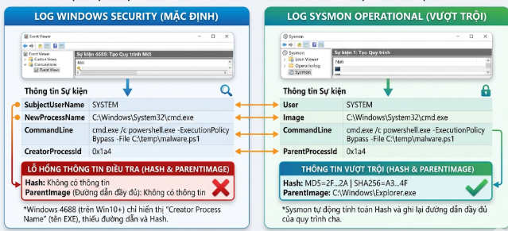
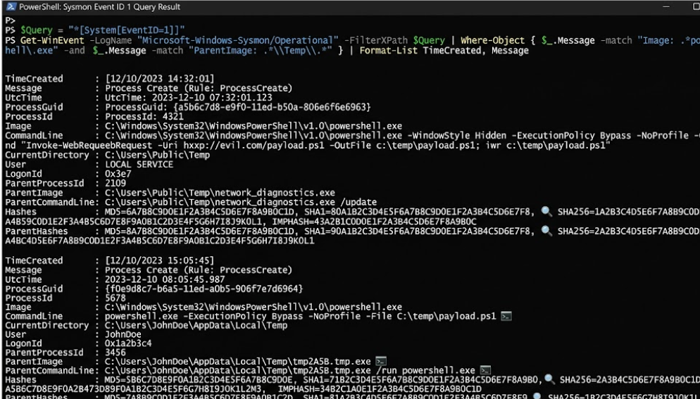

Chào mừng các bạn quay trở lại với Series Giải phẫu Windows OS & SOC Analytics! Ở các bài viết trước, chúng ta đã học cách đọc nhật ký hệ thống (Event Logs) mặc định của Windows. Nhưng trong thực tế chiến đấu, các hacker ngày càng tinh vi, chúng thừa sức qua mặt những log cơ bản này. Đó là lúc các chuyên gia SOC phải viện đến "vũ khí hạng nặng": Sysmon (System Monitor). Hôm nay, chúng ta sẽ đi sâu vào hướng dẫn cài đặt tư duy giám sát Sysmon, mở đầu bằng việc "mổ xẻ" quá trình sinh tiến trình (Process Creation) và cách dùng mã Hash để lột mặt nạ mã độc.

## 1. Sysmon là gì? Tại sao Windows Event Logs mặc định là chưa đủ?

Sysmon là một công cụ miễn phí cực kỳ mạnh mẽ thuộc bộ phần mềm Microsoft Sysinternals. Đối với giới bảo mật, Sysmon đã trở thành tiêu chuẩn vàng cho việc giám sát nâng cao.

Hãy làm một phép so sánh thực tế khi một phần mềm được mở lên:
- **Windows Event ID 4688 (Mặc định):** Chỉ cho bạn biết "Ai đó vừa chạy một tiến trình mới" (ví dụ: `cmd.exe` vừa được chạy bởi Administrator).
- **Sysmon Event ID 1 (Process Creation):** Không chỉ nói cho bạn biết file nào vừa chạy, mà nó còn cung cấp dấu vân tay (Mã Hash) của file đó, cho biết chính xác tiến trình nào đã gọi nó ra (Parent Image), và thậm chí là lệnh (Command Line) chi tiết đã được gõ vào.

**Tóm lại:** Windows EID 4688 cho biết "ai chạy", còn Sysmon EID 1 cho biết "vân tay" của kẻ đó. Nếu không có mã Hash, bạn sẽ gần như "mù" trước các kỹ thuật đổi tên ngụy trang của Hacker.

## 2. Giải phẫu chi tiết Sysmon Event ID 1

Khi Sysmon Event ID 1 nổ ra, nó cung cấp cho SOC Analyst một bức tranh toàn cảnh không thể chối cãi. Hãy cùng "soi" vào các trường dữ liệu sinh tử của nó:

### 2.1 Thông tin định danh (Process Info)
- **ProcessId:** Số định danh tiến trình trong hệ thống.
- **Image:** Đường dẫn vật lý của file thực thi trên ổ cứng (VD: `C:\Windows\System32\cmd.exe`).
- **CommandLine:** Ghi lại chính xác từng chữ mà kẻ tấn công đã gõ vào lệnh.

### 2.2 Nguồn gốc khởi tạo (Parent Info)
Mã độc hiếm khi tự nhiên sinh ra. Nó luôn được một thứ gì đó gọi ra.
- **ParentImage:** Đây là tiến trình cha. Việc nhìn vào tiến trình cha giúp bạn biết lệnh này do người dùng click chuột mở (như từ `explorer.exe`) hay bị gọi ngầm bởi một đoạn mã độc.

### 2.3 Dấu vân tay của tệp (Binary Info)
- **Hashes:** Sysmon sẽ tự động tính toán mã Hash (như MD5, SHA256) của file thực thi ngay khi nó chạy. Đây là tính năng "đáng tiền" nhất của Sysmon.



## 3. "Bắt thóp" Mã độc: Kỹ năng Threat Hunting thực chiến

Với các thông tin từ Sysmon EID 1, làm sao để phát hiện bất thường? Đừng tìm kiếm ngẫu nhiên, hãy bám vào 3 dấu hiệu (Red Flags) sau:

### Kỹ thuật 1: Lột mặt nạ ngụy trang (Masquerading) bằng mã Hash
Hacker hiểu rằng nếu chạy một file có tên `virus_an_cap.exe`, chúng sẽ bị tóm ngay. Vì thế, chúng thường đổi tên mã độc thành các tiến trình hệ thống chuẩn như `cmd.exe`, `svchost.exe` hay `lsass.exe`.

Tuy nhiên, dù tên file có đổi, mã Hash thì không bao giờ thay đổi. Khi Sysmon ghi lại mã SHA256 của tiến trình `cmd.exe` giả mạo đó, bạn chỉ cần ném mã Hash đó lên VirusTotal. Mã Hash sẽ lập tức "tố cáo" đó là một file độc hại chứ không phải file chuẩn của Microsoft.

### Kỹ thuật 2: Phân tích Phả hệ Tiến trình (Parent-Child Anomalies)
Đây là kỹ năng "nhìn thấu" logic hoạt động của hệ thống. Những tiến trình cha - con sau đây là cực kỳ phi logic và chắc chắn là mã độc:
- **WINWORD.EXE (Microsoft Word) sinh ra powershell.exe hoặc cmd.exe:** Rất có thể một nhân viên vừa mở file Word chứa mã độc Macro, và nó đang gọi lệnh tải virus về máy.
- **notepad.exe sinh ra cmd.exe:** Notepad chỉ là phần mềm gõ văn bản, nó tuyệt đối không có lý do gì để gọi cửa sổ dòng lệnh.

### Kỹ thuật 3: Truy vết các đường dẫn và câu lệnh đáng ngờ
Bạn cần cấu hình SIEM (hoặc viết script PowerShell) báo động ngay lập tức nếu tiến trình (Image) được chạy từ các thư mục trú ẩn quen thuộc của malware như:
- `C:\Users\*\AppData\Local\Temp\`
- `C:\Users\Public\`

Bên cạnh đó, hãy soi kỹ trường `CommandLine`. Hacker thường dùng các lệnh sau để tải mã độc thẳng vào RAM hoặc giải mã script:
- `-EncodedCommand` (Chạy mã PowerShell đã mã hóa Base64)
- `IEX (New-Object Net.WebClient)` (Lệnh tải file từ Internet)
- `certutil -urlcache` hoặc `bitsadmin /transfer` (Lợi dụng phần mềm có sẵn của Windows để tải virus)

## 4. Thực hành truy vấn Sysmon bằng PowerShell

Thay vì click chuột mỏi tay trong Event Viewer, các Threat Hunter thường dùng PowerShell để săn lùng (Hunting) dấu vết tiến trình độc hại. Dưới đây là đoạn code mẫu giúp bạn trích xuất tất cả các lần `powershell.exe` được gọi ra bởi thư mục Temp:

```powershell
# Truy vấn Sysmon Event ID 1 (Process Create)
$Query = "*[System[EventID=1]]"

# Lọc các sự kiện có Image là powershell và ParentImage nằm trong thư mục Temp
Get-WinEvent -LogName "Microsoft-Windows-Sysmon/Operational" -FilterXPath $Query | 
    Where-Object {
        $_.Message -match "Image: .*powershell\.exe" -and 
        $_.Message -match "ParentImage: .*\\Temp\\.*"
    } | Format-List TimeCreated, Message
```


---

*Bằng cách tận dụng Sysmon Event ID 1, bạn đã bịt được lỗ hổng khổng lồ của Event Viewer mặc định. Mã Hash và Cây tiến trình (Parent-Child) chính là hai thanh gươm sắc bén nhất để lột mặt nạ mọi loại mã độc ngụy trang. Trong bài viết tới (Phần 2), chúng ta sẽ tiếp tục đi sâu vào các Event ID khác của Sysmon (EID 3, 10, 11) để truy vết mã độc tàng hình (Fileless Malware) và hành vi ăn cắp mật khẩu. Hẹn gặp lại các bạn!*
