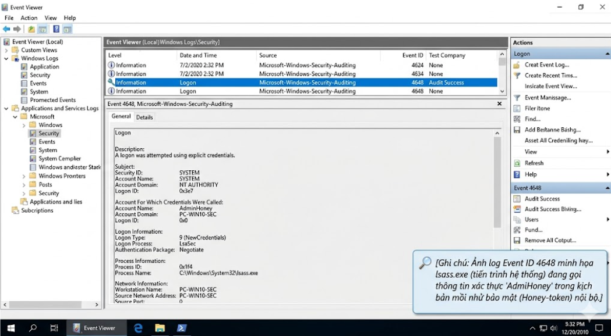

Chào mừng các bạn tiếp tục với Series Giải phẫu Windows OS & SOC Analytics! Bất kỳ cuộc tấn công mạng nào, dù tinh vi đến đâu, cũng thường bắt đầu hoặc kết thúc bằng việc kẻ tấn công cố gắng "gõ cửa" hệ thống qua cơ chế đăng nhập. Đối với một nhà phân tích SOC, nhánh Security Logs là mỏ vàng, và các sự kiện Đăng nhập/Đăng xuất (Logon/Logoff) chính là chìa khóa để nhận diện kẻ xâm nhập. Hôm nay, chúng ta sẽ "mổ xẻ" bộ 3 Event ID sinh tử: 4624, 4625, 4648 cùng từ điển Logon Types để vạch trần mọi kỹ thuật dò mật khẩu hay mạo danh trên hệ thống.

## 1. Từ điển "Logon Types": Ngôn ngữ giao tiếp của Hệ điều hành

Khi bạn phân tích một log đăng nhập (dù thành công hay thất bại), việc chỉ nhìn vào tài khoản (Account Name) là chưa đủ. Bạn bắt buộc phải nhìn vào **Logon Type** (Cách thức đăng nhập) để biết kẻ đó đang "vào nhà" bằng cửa chính, cửa sổ hay leo rào.

Dưới đây là các Logon Type quan trọng nhất mà một SOC Analyst phải thuộc nằm lòng:
- **Type 2 (Interactive):** Đăng nhập tương tác trực tiếp. Nghĩa là người dùng (hoặc kẻ tấn công) đang thực sự ngồi trước bàn phím vật lý của cái máy tính đó để gõ mật khẩu.
- **Type 3 (Network):** Truy cập qua mạng. Thường thấy khi người dùng truy cập vào thư mục dùng chung (File Share), máy in mạng hoặc khi một tập lệnh từ xa được thực thi.
- **Type 4 (Batch):** Đăng nhập dạng khối. Thường được sử dụng bởi các tác vụ lập lịch (Scheduled Tasks) tự động chạy định kỳ.
- **Type 5 (Service):** Đăng nhập dạng dịch vụ. Đây là lúc một dịch vụ hệ thống khởi chạy ngầm dưới quyền một tài khoản cụ thể. **Góc nhìn SOC:** Nếu hàng trăm log Type 5 nổ ra từ các dịch vụ lạ, có thể mã độc đang tự động gọi tiến trình (spawn process) hàng loạt.
- **Type 10 (Remote Interactive):** Đăng nhập qua Remote Desktop Protocol (RDP). Đây là Logon Type bị hacker lợi dụng nhiều nhất để tấn công từ xa.

## 2. Event ID 4625: Tiếng "gõ cửa" của kẻ lạ mặt (Logon Failure)

Mỗi khi có người nhập sai mật khẩu, Windows sẽ sinh ra **Event ID 4625**. Một vài log 4625 rải rác là bình thường (do người dùng gõ nhầm), nhưng nếu nó nổ ra hàng loạt, hệ thống của bạn đang bị tấn công.

Để biết chính xác mục tiêu của kẻ tấn công, chúng ta dựa vào trường Status và Sub Status (Mã lỗi):
- `0xC000006A` (Bad Password): Tài khoản có tồn tại, nhưng gõ sai mật khẩu.
- `0xC0000064` (User Does Not Exist): Tên người dùng không tồn tại. Nếu bạn thấy mã này nhiều lần, hacker đang thực hiện dò quét liệt kê tài khoản (Username Enumeration).
- `0xC0000234` (Account Locked): Đăng nhập vào một tài khoản đã bị khóa do gõ sai quá số lần quy định.

### 2.1 Kỹ năng phân biệt Brute Force và Password Spraying

- **Brute Force (Vét cạn):** Hacker nhắm vào 1 tài khoản (VD: Administrator) và thử hàng nghìn mật khẩu khác nhau. **Dấu hiệu:** Nhiều log 4625 liên tiếp, cùng một Account Name, mã lỗi `0xC000006A`, dồn dập trong vài giây từ một IP lạ (Source Network Address).
- **Password Spraying (Phun mật khẩu):** Để tránh bị khóa tài khoản (Account Lockout), hacker lấy 1 mật khẩu phổ biến (VD: "Admin@123") và thử lần lượt trên hàng trăm user khác nhau. **Dấu hiệu:** Nhiều log 4625, cùng một IP nguồn, nhưng Account Name thay đổi liên tục, xuất hiện mã lỗi trộn lẫn giữa `0xC000006A` và `0xC0000064`.


## 3. Event ID 4624: Khi cánh cửa mở ra (Logon Success)

**Event ID 4624** cho biết một tài khoản đã đăng nhập thành công vào hệ thống. Nếu log này xuất hiện ngay sau một chuỗi dài các log 4625, xin chia buồn, hệ thống của bạn đã bị xuyên thủng!

> **Mẹo điều tra với RDP (Network Level Authentication - NLA):** Khi hệ thống bật tính năng xác thực cấp mạng (NLA) cho Remote Desktop, quy trình sinh log sẽ hơi "đánh lừa" bạn một chút:
> 1. Đầu tiên, máy khách gửi thông tin xác thực lên. Windows xử lý việc này như một kết nối mạng thông thường và ghi nhận Log 4624 với Logon Type 3.
> 2. Sau khi xác thực Type 3 thành công, phiên giao diện đồ họa RDP mới thực sự được vẽ ra. Lúc này Windows mới tiếp tục ghi nhận thêm một Log 4624 với Logon Type 10.

Khi điều tra, bạn nhớ ghi lại trường thông tin `Logon ID` (VD: `0x183C36D`). Đây là mã định danh phiên làm việc, giúp bạn xâu chuỗi mọi hoạt động (tạo tiến trình, truy cập file) mà tài khoản đó thực hiện sau khi vào máy.

## 4. Event ID 4648: Kỹ thuật Mạo danh (Explicit Credentials)

Hacker không phải lúc nào cũng đăng nhập từ bên ngoài vào. Nếu chúng đã lọt vào máy bạn dưới quyền một người dùng thường (nhân viên lễ tân), chúng sẽ cố gắng mạo danh Admin bằng kỹ thuật sử dụng thông tin xác thực rõ ràng (Explicit Credentials) - sinh ra **Event ID 4648**.

Log 4648 ghi lại việc một tiến trình cố gắng đăng nhập vào một tài khoản bằng cách "mượn" danh tính (như lệnh `runas`) thay vì đăng nhập trực tiếp qua màn hình.

**Dấu hiệu báo động đỏ (Red Flag) từ 4648:**
- **SubjectUserName:** Người dùng thường.
- **TargetUserName:** Administrator hoặc Service account.
- **Process Name:** Bình thường sẽ là `explorer.exe` hoặc `mmc.exe`. Nếu bạn thấy tiến trình thực hiện hành động này là `powershell.exe`, `cmd.exe` hoặc `rundll32.exe`, 100% đó là mã độc đang thực hiện leo thang đặc quyền (Privilege Escalation) hoặc di chuyển ngang (Lateral Movement) sang máy chủ khác.



## 5. Thực chiến SOC: Viết Rule giám sát bằng SIEM (Wazuh)

Đứng ở góc độ một SOC Analyst, chúng ta không đếm log bằng tay mà sẽ cấu hình các SIEM rule tự động báo động. Dưới đây là ví dụ cấu hình mã XML cho Wazuh để phát hiện hành vi Brute Force và Password Spraying:

### Phát hiện Brute Force (Vét cạn 1 tài khoản)
Rule này sẽ cảnh báo nếu có 5 lần gõ sai mật khẩu (EID 4625) vào cùng một tài khoản trong vòng 60 giây:

```xml
<rule id="100001" level="10">
  <if_sid>4625</if_sid>
  <frequency>5</frequency>
  <timeframe>60</timeframe>
  <same_field>win.eventdata.TargetUserName</same_field>
  <description>Multiple failed logon - possible brute force nhắm vào 1 tài khoản</description>
</rule>
```

### Phát hiện Password Spraying (Phun mật khẩu qua RDP)
Rule này cực kỳ sắc bén: Nếu Logon Type là 10 (RDP) bị lỗi sai mật khẩu (`0xC000006A`) trên 5 tài khoản khác nhau trong vòng 5 phút (300 giây):

```xml
<rule id="100013" level="12">
  <if_sid>4625</if_sid>
  <field name="win.eventdata.LogonType">10</field>
  <field name="win.eventdata.Status">0xC000006A</field>
  <different_field>win.eventdata.TargetUserName</different_field>
  <frequency>5</frequency>
  <timeframe>300</timeframe>
  <description>RDP Password Spray - {frequency} tài khoản khác nhau đăng nhập RDP thất bại trong {timeframe} giây</description>
</rule>
```

---

*Việc đọc hiểu cấu trúc Event Logs liên quan đến Authentication là kỹ năng nền tảng giúp SOC Analyst phân tách được các nỗ lực truy cập mạng hợp lệ khỏi các chiến dịch xâm nhập. Chỉ cần bắt được một gợn sóng nhỏ từ 4625 hay 4648, bạn hoàn toàn có thể chặt đứt cuộc tấn công ngay từ lúc kẻ gian đang đứng ngoài cửa. Ở bài viết tiếp theo, chúng bản phân tích kỹ hơn về dấu vết của Hacker sau khi chúng đã xâm nhập: Quản lý người dùng, tạo Backdoor và các log báo hiệu bị thay đổi đặc quyền (EID 4672, 4720, 4732). Hãy cùng theo dõi nhé!*
