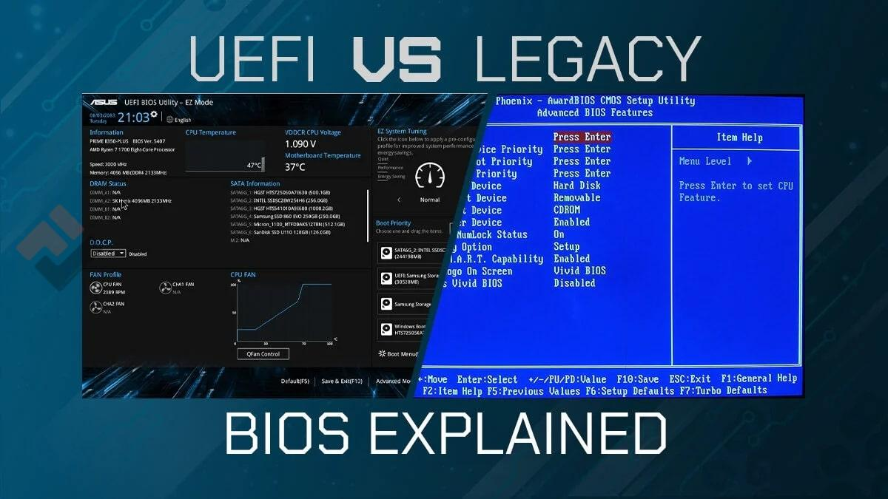
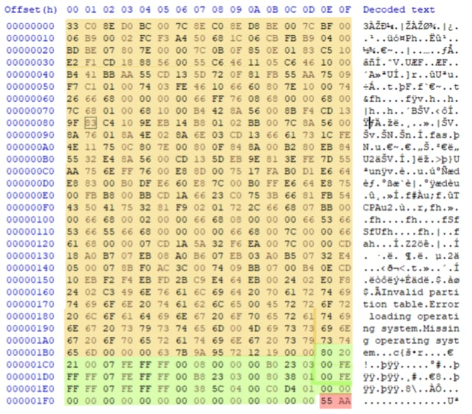

Chào mừng các bạn đến với Series Giải phẫu Windows OS & SOC Analytics. Ở bài viết đầu tiên này mình sẽ giúp các bạn hiểu về quá trình khởi tạo của Windows.
## 1. Giai đoạn Phần cứng: Tiếng gọi đầu tiên (Pre-boot)

Bước đầu tiên của quá trình khởi động bắt đầu bằng việc nhấn nút nguồn, thao tác này sẽ gửi tín hiệu điện đến bo mạch chủ và khởi tạo tất cả các thành phần. CPU là thành phần đầu tiên nhận tín hiệu điện và cần một số chỉ dẫn để tiếp tục. Lúc này, quá trình kiểm tra phần cứng POST (Power on Self-Test) sẽ diễn ra để xem RAM, CPU, bàn phím có hoạt động không.

Để có chỉ dẫn, CPU sẽ tìm đến một phần mềm nhúng trên bo mạch chủ (được gọi chung là **Firmware**). Trong lịch sử thiết kế hệ thống, có hai chuẩn Firmware khởi động chính và sự khác biệt giữa chúng là điểm mấu chốt trong điều tra số:

- **Legacy BIOS (Hệ thống đầu vào/đầu ra cơ bản):** Chuẩn Firmware cũ kỹ hoạt động ở chế độ 16-bit và chỉ hỗ trợ dung lượng ổ đĩa tối đa 2 terabyte. Legacy BIOS đi liền với lược đồ phân vùng MBR (Master Boot Record).
- **UEFI (Giao diện phần mềm mở rộng thống nhất):** Chuẩn Firmware thế hệ mới, hiện đại chạy ở chế độ 32-bit/64-bit, hỗ trợ dung lượng lên đến 9 zettabyte và mang theo tính năng Khởi động an toàn (Secure Boot). UEFI sử dụng sơ đồ phân vùng GPT (GUID Partition Table).

> *(Lưu ý: Dân IT chúng ta vẫn hay quen miệng gọi chung là "vào màn hình BIOS để cài đặt", nhưng thực chất trên các máy tính từ năm 2012 trở lại đây, cái mà chúng ta đang truy cập chính là giao diện của UEFI. Trong UEFI có một chế độ gọi là **Legacy Mode** dùng để giả lập lại môi trường BIOS cũ nhằm hỗ trợ cài các hệ điều hành đời cổ).*

## 2. Giai đoạn Tìm kiếm "Sự Sống": MBR và GPT

Sau khi kiểm tra POST, BIOS/UEFI sẽ quét các thiết bị khởi động (SSD, HDD, USB) để tìm kiếm mã khởi động (có thể hiểu là đi tìm điểm bắt đầu, và tất nhiên các thiết bị lưu trữ sẽ được ưu tiên hàng đầu).

### 2.1. BIOS đi tìm MBR (Master Boot Record)

Trên hệ thống BIOS, sector đầu tiên của đĩa (kích thước chuẩn 512 byte) sẽ chứa MBR. Cấu trúc của MBR cực kỳ chật chội:

- **Bootstrap code (446 bytes):** Bộ nạp khởi động ban đầu. Mục đích chính của nó là tìm phân vùng có thể khởi động từ bảng phân vùng và tải bộ nạp khởi động thứ hai từ đó.
- **Partition Table (64 bytes):** Bảng phân vùng chứa thông tin chi tiết của tất cả phân vùng (tối đa 4 phân vùng Primary).
- **MBR Signature (2 bytes):** Chữ ký đánh dấu điểm kết thúc của mã MBR, luôn luôn là giá trị Hex `55 AA`.

**Note:** Vì mã khởi động nằm ngay trong 446 bytes này, Malware (như Bootkit) cực kỳ thích ghi đè vào đây. Bằng cách này, mã độc sẽ sống sót ngay cả khi người dùng format phân vùng hệ điều hành C: vì nó nằm hoàn toàn ngoài vùng kiểm soát của OS.

### 2.2. Sự tiến hóa: GPT và Protective MBR

UEFI thông minh hơn. Nó không tìm mã khởi động ở sector đầu tiên mà tìm đến một phân vùng đặc biệt gọi là Phân vùng hệ thống EFI (ESP). Trong GPT, bộ nạp khởi động bao gồm nhiều tệp có phần mở rộng `.efi` và tất cả chúng đều được lưu trữ trong ESP này.

Tuy nhiên, để bảo vệ đĩa GPT khỏi bị các hệ thống BIOS cũ tưởng nhầm là đĩa trắng và ghi đè, GPT tạo ra một lớp giáp gọi là Protective MBR nằm ở ngay sector 0. Protective MBR này chỉ khai báo đúng một phân vùng duy nhất trỏ đến ESP với cờ định dạng là EE (báo hiệu đây là đĩa GPT), để firmware BIOS không can thiệp vào.

## 3. Giai đoạn Nạp nhân (Windows OS Loader)

Sau khi phân vùng khởi động được xác định, quyền điều khiển được chuyển sang Windows Boot Manager (file `bootmgr`). Nó sẽ đọc file dữ liệu cấu hình khởi động (BCD - Boot Configuration Data) để quyết định sẽ nạp hệ điều hành nào.

Tiếp theo, logo Windows bắt đầu hiện lên trên màn hình. Đây là lúc file nạp hệ điều hành (`Winload.exe` hoặc `winload.efi`) ra sân để nạp các thành phần cốt lõi nhất vào RAM:

- `ntoskrnl.exe`: Trái tim thực sự của hệ thống - Nhân (Kernel) của Windows.
- `Hal.dll`: Lớp trừu tượng phần cứng, có nhiệm vụ "phiên dịch" để Kernel có thể ra lệnh được cho các linh kiện phần cứng vật lý.
- **System Registry Hive**: Nạp các thiết lập cấu hình tối quan trọng của hệ thống từ Registry.
- **Boot-start Drivers**: Các driver tối quan trọng để có thể tiếp tục đọc ổ đĩa.

## 4. Giai đoạn Khởi tạo hệ thống: Ranh giới và Các tiến trình đầu tiên

Khi Kernel (`ntoskrnl.exe`) đã nằm vững chãi trên RAM, nó bắt đầu thiết lập trật tự cho hệ thống. Đây là lúc sự phân chia hai cõi Kernel Mode (toàn quyền) và User Mode (hạn chế) được xác lập.

Sau khi kernel khởi động xong, tiến trình System (PID 4) sẽ tạo ra tiến trình User Mode đầu tiên của hệ thống: `smss.exe` (Session Manager Subsystem).

`smss.exe` là "ông tổ" của toàn bộ các phiên làm việc trên Windows. Nhiệm vụ của nó là tạo ra các biến môi trường, thiết lập bộ nhớ ảo và bắt đầu chia phòng (Session).

- **Tạo Session 0:** Khu vực cấm địa chỉ dành riêng cho các dịch vụ hệ thống ngầm.
- **Tạo Session cho người dùng:** Môi trường hiển thị giao diện cho chúng ta làm việc.

### 4.1. Sự hình thành các cây tiến trình (Process Tree)

Cách `smss.exe` sinh con:

**Trong Session 0 (Hệ thống):**
`smss.exe` gọi ra `wininit.exe` (khởi tạo dịch vụ hệ thống) và `csrss.exe` (runtime subsystem cho session 0).

`wininit.exe` sau đó tiếp tục tạo ra hai mảnh ghép quan trọng:
- `services.exe`: Trình quản lý dịch vụ. Nó sẽ khởi chạy hàng loạt các dịch vụ hệ thống, phần lớn được bọc bên trong các tiến trình `svchost.exe`.
- `lsass.exe` (Local Security Authority Subsystem Service): Người gác đền quản lý bảo mật và xác thực thông tin đăng nhập.

**Trong Session người dùng:**
`smss.exe` gọi ra một phiên bản `csrss.exe` khác (để xử lý console giao diện) và `winlogon.exe` (hiển thị màn hình đăng nhập quen thuộc).

Khi bạn nhập mật khẩu trên màn hình của `winlogon.exe`, nó sẽ gửi thông tin đến `lsass.exe` để đối chiếu. Nếu mật khẩu đúng, `lsass.exe` sẽ gật đầu và tạo ra một "thẻ bài" (Access Token) cấp quyền cho phiên làm việc của bạn.

> **Góc nhìn SOC:** Hacker hiểu rõ thứ tự này. Nếu bạn thấy một tiến trình `lsass.exe` hoặc `svchost.exe` nằm "chơi vơi" mà không có tiến trình cha hợp lệ (như `wininit.exe` hay `services.exe`), hoặc file thực thi không nằm trong `C:\Windows\System32\`, thì 99% đó là phần mềm độc hại đang "đội lốt" tiến trình hệ thống. Ngoài ra, tiến trình `lsass.exe` nắm giữ mật khẩu của hệ thống, nên nó thường xuyên là mục tiêu để các công cụ như Mimikatz "dump" bộ nhớ hòng đánh cắp thông tin xác thực.

---

*Kết thúc Bài 1, chúng ta đã nắm được cách một cỗ máy tính thức giấc và xây dựng cấu trúc tiến trình chặt chẽ của nó. Ở bài tiếp theo, chúng ta sẽ bắt tay vào phân tích chuyên sâu về hệ thống tệp và cấu trúc thư mục đĩa đệm. Hãy đón chờ nhé!*
