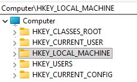
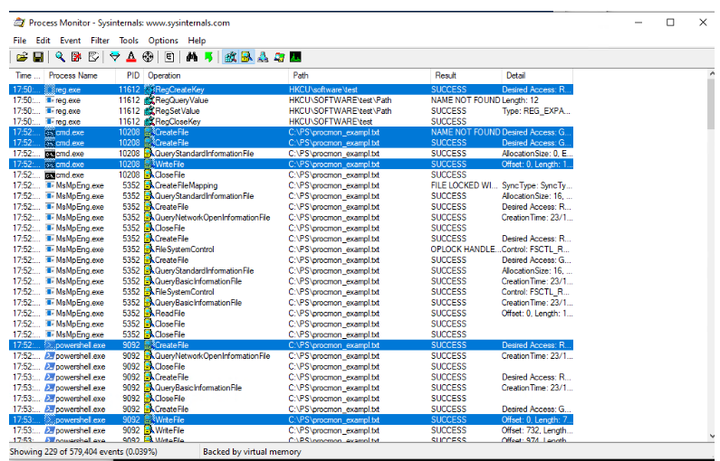

Chào mừng các bạn tiếp tục với Series Giải phẫu Windows OS & SOC Analytics! Chúng ta đã biết File System là nơi cất giữ dữ liệu, vậy đâu là nơi lưu trữ các quy tắc điều hành máy tính? Làm sao hệ thống biết khi bật máy lên phải chạy những phần mềm nào, hình nền của bạn màu gì, hay file `.docx` thì phải mở bằng Microsoft Word? Câu trả lời nằm ở "bộ não" của Windows: Registry. Hôm nay, chúng ta sẽ mổ xẻ cơ sở dữ liệu khổng lồ này và học cách giám sát nó bằng ProcMon.

## 1. Windows Registry là gì? Cấu trúc của các Hives

Windows Registry là một cơ sở dữ liệu phân cấp khổng lồ, làm nhiệm vụ lưu trữ toàn bộ các thiết lập phần cứng, cấu hình phần mềm, tùy chọn của người dùng và các thiết lập bảo mật cốt lõi của hệ điều hành Windows.

Mặc dù khi mở công cụ `regedit.exe`, bạn sẽ thấy Registry hiển thị như một cây thư mục thống nhất, nhưng thực tế nó được ghép lại từ nhiều tệp tin vật lý (gọi là các Hives) nằm rải rác trên ổ cứng.

Cấu trúc cốt lõi của Registry được chia thành 5 nhánh (Hives) chính:
- **HKEY_CLASSES_ROOT (HKCR):** Quản lý thông tin về các định dạng file (ví dụ: quy định file `.txt` thì mở bằng Notepad) và các thành phần COM/OLE.
- **HKEY_CURRENT_USER (HKCU):** Lưu cấu hình riêng của người dùng đang đăng nhập hiện tại (như hình nền, màu sắc giao diện, các icon hay app cá nhân).
- **HKEY_LOCAL_MACHINE (HKLM):** Đây là nhánh quan trọng nhất dưới góc độ SOC. Nó lưu trữ cấu hình của toàn bộ máy tính, bao gồm phần cứng, Driver, thiết lập mạng, bảo mật và các phần mềm dùng chung cho mọi người dùng.
- **HKEY_USERS (HKU):** Chứa tất cả các profile (hồ sơ) của mọi người dùng từng đăng nhập trên máy tính này. Thực chất, dữ liệu của nhánh HKCU chỉ là một bản ánh xạ từ một nhánh con bên trong HKU.
- **HKEY_CURRENT_CONFIG (HKCC):** Chứa các thông tin về cấu hình phần cứng hiện tại đang được sử dụng ở lần khởi động này.

## 2. Cơ chế hoạt động: Nguồn gốc dữ liệu và Sự "lắng nghe"

Vậy làm sao các phần mềm biết phải ghi thông tin vào đâu trong Registry, và Windows lấy dữ liệu ra như thế nào?

### 2.1 Tài liệu MSDN (Microsoft Developer Network)

Khi Microsoft tạo ra Windows, họ thiết kế một bộ quy tắc và công khai các khóa Registry thông qua tài liệu SDK/MSDN. Nhờ đó, các lập trình viên phần mềm (như Adobe, Google,...) biết cách đăng ký dịch vụ, thiết lập quyền hạn hoặc tùy chỉnh giao diện ứng dụng của mình. Chẳng hạn, các khóa tự khởi động (Run keys) được ghi chép rất rõ ràng để phần mềm biết chỗ mà "cắm chốt" khởi động cùng máy.

### 2.2 Cơ chế "Lắng nghe" (Event-Driven)

Một câu hỏi thú vị: Tại sao khi bạn vào Registry, đổi một Key từ `False` sang `True` thì thanh Dock (hoặc Taskbar) lại lập tức thay đổi vị trí?

Bản chất của vấn đề là: Windows (và các tiến trình như `explorer.exe`) liên tục thực hiện hành động "đọc" Registry. Registry thực chất chỉ là một "cái kho" hay một bảng cài đặt khổng lồ. Việc một tính năng có hoạt động hay không là do mã nguồn của Windows đã được lập trình để luôn nhìn vào cái kho đó trước khi thực hiện hành động. Hệ thống chạy một đoạn mã logic dạng: *"Nếu giá trị tại Key [ThanhDock] là True thì vẽ nó ở giữa, nếu là False thì vẽ bên trái"*.

## 3. Kỹ thuật Đảo ngược và Giám sát bằng ProcMon

Vì Registry là một cái kho tĩnh, đôi khi có những "bí mật" hoặc các khóa Registry không hề được Microsoft ghi trong tài liệu chính thức. Vậy làm sao các chuyên gia hay những "người ham vọc vạch" tìm ra chúng? Câu trả lời là Kỹ thuật Đảo ngược (Reverse Engineering) bằng việc giám sát thời gian thực.

Công cụ đắc lực nhất cho việc này là **Process Monitor (ProcMon)** - một phần mềm thuộc bộ Sysinternals do chính Microsoft cung cấp.

**Cách thực chiến với ProcMon:**
1. Bật ProcMon và đặt bộ lọc (Filter) chỉ theo dõi các sự kiện liên quan đến Registry (Registry Activity).
2. Mở giao diện cài đặt của Windows lên (ví dụ: cài đặt vị trí thanh Dock hoặc tắt/bật một tính năng bảo mật).
3. Thực hiện thay đổi (click chuột, bấm Apply) và ngay lập tức quan sát trên màn hình ProcMon.
4. ProcMon sẽ bắt được chính xác tiến trình nào của Windows vừa thực hiện lệnh Write (ghi) giá trị gì vào đường dẫn khóa Registry nào.

Bằng cách khoa học này, các nhà phân tích bảo mật có thể dễ dàng bắt thóp được mọi hành vi ngầm mà một ứng dụng (hoặc một mã độc) đang cố tình can thiệp vào hệ thống.

## 4. Góc nhìn SOC: Điểm neo của Hacker (Persistence)

Registry không chỉ đơn thuần lưu trữ cài đặt, nó còn có khả năng ra lệnh cho Windows phải làm gì. Do đó, đây là "mỏ vàng" để virus và mã độc lẩn trốn, đảm bảo rằng dù bạn có xóa file thực thi trên màn hình, mã độc vẫn sẽ tự động quay lại (Persistence) nhờ các dòng lệnh được nhúng trong Registry.

Những vị trí Registry nhạy cảm nhất mà một SOC Analyst phải thường xuyên giám sát bao gồm:

### 4.1 Các khóa tự khởi động (Auto Run Keys)

Hacker cực kỳ thích "cắm chốt" tại các đường dẫn sau để mã độc chạy ngay khi bật máy:
- `HKLM\SOFTWARE\Microsoft\Windows\CurrentVersion\Run`
- `HKCU\Software\Microsoft\Windows\CurrentVersion\Run`
- `HKLM\SOFTWARE\Microsoft\Windows\CurrentVersion\RunOnce`

*(Lưu ý: HKLM sẽ chạy cho toàn bộ máy tính và yêu cầu quyền Admin để ghi, trong khi HKCU chỉ chạy cho người dùng hiện tại).*

### 4.2 Lợi dụng tính năng Userinit (Winlogon)

Được thiết kế để chuẩn bị môi trường làm việc sau khi đăng nhập, khóa Registry sau quy định chương trình khởi tạo mặc định của Windows:
- `HKLM\SOFTWARE\Microsoft\Windows NT\CurrentVersion\Winlogon\Userinit`

Giá trị mặc định của nó chỉ là `userinit.exe`. Hacker rất ranh ma, chúng không xóa file gốc mà chỉ cần nối thêm một dấu phẩy (`,`) và ghi kèm đường dẫn mã độc của chúng vào đằng sau (ví dụ: `userinit.exe, C:\Temp\malware.bat`) để được hệ thống "rước" vào máy một cách hợp lệ.

### 4.3 Vô hiệu hóa sức đề kháng (Security Evasion)

Ngoài việc thiết lập khởi động, hacker còn trực tiếp can thiệp Registry để "bịt mắt" các phần mềm bảo mật:
- **Tắt Windows Defender:** Bằng cách sửa khóa `HKLM\SOFTWARE\Policies\Microsoft\Windows Defender`, gán giá trị `DisableAntiSpyware = 1`.
- **Vô hiệu hóa UAC:** Sửa giá trị `EnableLUA = 0` tại khóa `HKLM\SOFTWARE\Microsoft\Windows\CurrentVersion\Policies\System` để UAC không bao giờ hiện bảng thông báo quyền Admin nữa.

---

*Windows Registry thực sự là một hệ thần kinh phức tạp của hệ điều hành. Việc am hiểu cấu trúc Hives và biết cách sử dụng ProcMon để soi chiếu từng "nhịp đập" Write/Read của Registry sẽ biến bạn thành một thợ săn mã độc đáng gờm. Ở bài viết tới, chúng ta sẽ bắt tay vào thực hành săn lùng Malware trong Registry bằng bộ công cụ nâng cao Autoruns và cách phân tích chữ ký số (Digital Signatures). Hẹn gặp lại các bạn!*
