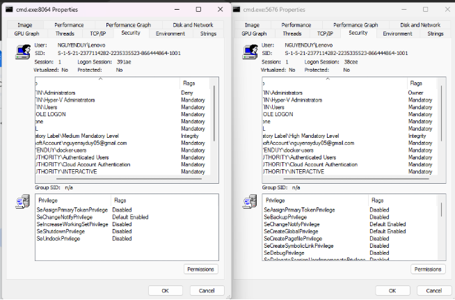
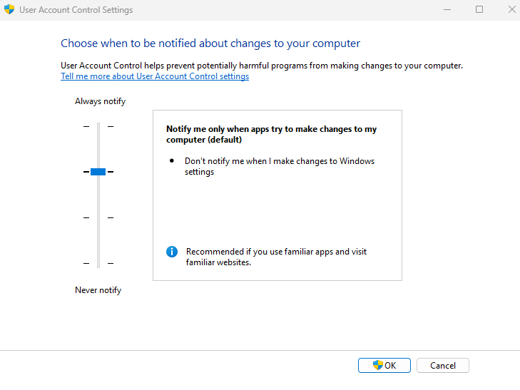
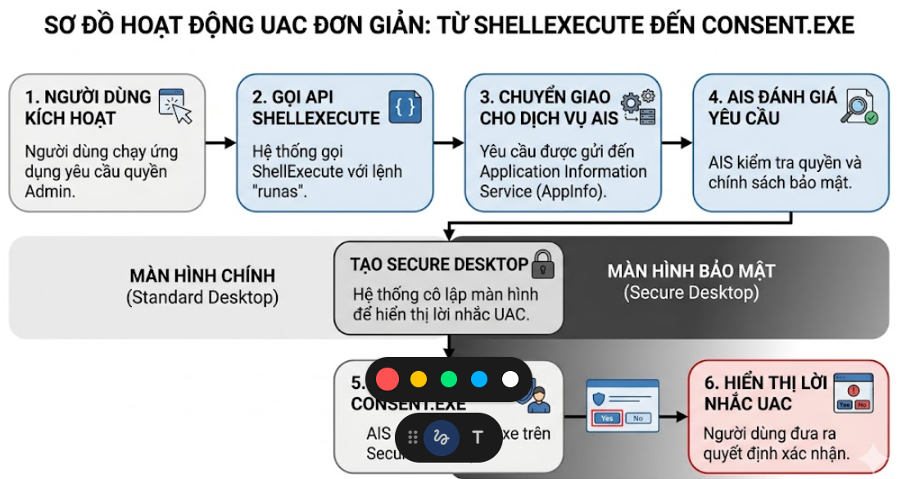

Chào mừng các bạn quay trở lại với Series Giải phẫu Windows OS & SOC Analytics! Nếu Registry là "bộ não", Event Logs là "nhật ký", thì UAC chính là "người gác cổng" khó tính nhất của Windows. Bạn từng tự hỏi tại sao mình đã đăng nhập bằng tài khoản Administrator mà thỉnh thoảng Windows vẫn làm tối đen màn hình và hỏi "Bạn có chắc chắn muốn chạy phần mềm này không?". Hôm nay, chúng ta sẽ đi sâu vào hệ thống phân quyền phức tạp này để hiểu tại sao nó lại là chốt chặn bảo mật quan trọng nhất, và cách các tiến trình hệ thống như Appinfo hay consent.exe vận hành.

## 1. Bản chất của UAC và Nguyên lý 2 "Thẻ bài" (Tokens)

User Account Control (UAC) là một tính năng bảo mật nhằm ngăn chặn các thay đổi trái phép đối với hệ điều hành. Cơ chế cốt lõi của nó nghe có vẻ ngược đời: Ngay cả khi bạn đăng nhập bằng tài khoản Quản trị viên (Administrator), các ứng dụng mà bạn mở lên mặc định vẫn chỉ chạy với quyền Người dùng tiêu chuẩn (Standard User).

Làm sao Windows làm được điều này? Nguyên lý nằm ở các **Access Tokens** (Thẻ bài quyền lực). Khi bạn đăng nhập bằng tài khoản Admin, Windows thực chất không cấp cho bạn toàn quyền ngay lập tức. Thay vào đó, nó cấp cho bạn 2 "thẻ bài": Một thẻ User thường và một thẻ Admin.

Trong quá trình sử dụng bình thường (lướt web, gõ văn bản), hệ thống chỉ dùng thẻ User. Chỉ khi nào bạn (hoặc một ứng dụng) cần thực hiện các hành động "nhạy cảm" (như sửa Registry hệ thống, cài driver), UAC mới hiện ra bảng thông báo để bạn xác nhận "nâng quyền" (Elevation). Lúc này, thẻ Admin mới được rút ra để sử dụng.

## 2. Ranh giới ưu tiên: Integrity Levels (Mức độ toàn vẹn)

Để SOC Analyst có thể phát hiện tiến trình nào đang chạy quyền cao hay thấp, chúng ta dựa vào khái niệm **Integrity Levels (IL)**. Hãy cùng làm một bài test thực tế: Mở hai cửa sổ Command Prompt (CMD), một cái mở bình thường (Open) và một cái mở bằng quyền Admin (Run as administrator).

Nếu soi hai tiến trình này bằng công cụ Process Hacker hoặc Sysinternals, bạn sẽ thấy sự khác biệt "một trời một vực":

### 2.1 Cửa sổ CMD bình thường (Quyền thấp)

- **Nhóm BUILTIN\Administrators:** Có cờ (Flag) là Deny. Điều này nghĩa là hệ thống đang nói: "Dù tài khoản của anh là Admin, nhưng cửa sổ này bị tước quyền quản trị".
- **Integrity Level:** Chạy ở mức *Medium Mandatory Level*. Đây là mức độ trung bình mặc định của người dùng thường.
- **Privileges (Đặc quyền):** Chỉ có một danh sách rất ngắn các quyền cơ bản, không thể can thiệp sâu vào hệ thống.

### 2.2 Cửa sổ CMD "Run as administrator" (Quyền cao)

- **Nhóm BUILTIN\Administrators:** Có cờ là Owner. Cửa sổ này có toàn quyền thực thi các lệnh hệ thống.
- **Integrity Level:** Chạy ở mức *High Mandatory Level*. Mọi tiến trình do CMD này sinh ra (như chạy file `.exe`) đều sẽ kế thừa quyền High IL này.
- **Privileges (Đặc quyền):** Danh sách dài hơn rất nhiều, bao gồm các quyền cực kỳ nguy hiểm như `SeBackupPrivilege`, `SeImpersonatePrivilege` và đặc biệt là `SeDebugPrivilege` (quyền gỡ lỗi, thường bị malware lợi dụng để can thiệp bộ nhớ).

## 3. Secure Desktop: Bức tường thành cô lập

Khi bảng thông báo UAC hiện lên, bạn có để ý rằng toàn bộ màn hình nền phía sau bị tối đen lại và bạn không thể click chuột vào bất kỳ ứng dụng nào khác không? Đó chính là tính năng **Secure Desktop**.

**Mục đích cốt lõi:** Secure Desktop tạo ra một màn hình nền hoàn toàn riêng biệt, cách ly bảng hỏi UAC khỏi không gian làm việc hiện tại. Nó đảm bảo rằng không có bất kỳ một phần mềm mã độc nào chạy ngầm có khả năng can thiệp hay "ấn hộ" bạn nút Yes. Chỉ có con người thật, cầm con chuột vật lý mới có thể tương tác với bảng thông báo này.

Tùy vào nhu cầu, Windows cho phép bạn thiết lập 4 cấp độ (Level) của UAC trong cài đặt:
1. **Always Notify:** Mức cao nhất, luôn làm tối màn hình (Secure Desktop) và hỏi khi có thay đổi.
2. **Notify me only when apps try to make changes (Default):** Chỉ hỏi khi ứng dụng bên thứ ba thay đổi hệ thống, không hỏi khi bạn tự tay chỉnh cài đặt Windows.
3. **Notify me only when apps try to make changes (Do not dim my desktop):** Giống mức 2 nhưng không làm tối màn hình. **Góc nhìn SOC:** Mức này rất nguy hiểm vì không dùng Secure Desktop, mã độc có thể dùng kỹ thuật giả lập click chuột (Clickjacking) để tự bấm Yes.
4. **Never Notify (Disable):** Tắt hoàn toàn UAC. Đây thực sự là "thiên đường" cho hacker, vì mã độc có thể tự do leo thang quyền hạn từ Medium lên High mà không gặp bất cứ rào cản nào.

## 4. Giải phẫu quy trình hoạt động của UAC

Để qua mặt được UAC, hacker phải hiểu tường tận quy trình hệ thống xử lý yêu cầu nâng quyền. Dưới góc nhìn kỹ thuật, "trái tim" của UAC là Dịch vụ Thông tin Ứng dụng (Appinfo). Khi bạn click "Run as administrator", 6 bước sau sẽ diễn ra trong chớp mắt:

1. **Gửi yêu cầu:** Người dùng yêu cầu chạy một ứng dụng (ví dụ: `cmd.exe`) với quyền quản trị.
2. **Gọi API:** Lệnh gọi API `ShellExecute` của Windows được kích hoạt, mang theo một động từ (verb) đặc biệt là `runas`.
3. **Appinfo tiếp nhận:** Yêu cầu này không được xử lý ngay mà chuyển tiếp đến dịch vụ Appinfo để quản lý việc nâng quyền.
4. **Kiểm tra Manifest:** Dịch vụ Appinfo sẽ đọc tệp kê khai (Manifest) của ứng dụng đó để xem tính năng Tự động nâng quyền (`autoElevate`) có được cho phép hay không. *(Bật mí: Hacker rất thích lợi dụng các file có sẵn autoElevate của Microsoft)*.
5. **Bật Secure Desktop:** Appinfo thực thi tiến trình `consent.exe`. Chính `consent.exe` là kẻ làm tối màn hình của bạn và vẽ ra cái bảng hỏi (Yes/No) trên môi trường Secure Desktop cô lập.
6. **Cấp "Thẻ bài":** Nếu bạn bấm Yes đồng ý, dịch vụ Appinfo sẽ lấy cái Mã thông báo nâng cao (Elevated Token - thẻ Admin) của bạn ra và áp vào ứng dụng. Sau đó, ứng dụng sẽ chính thức được khởi chạy dưới quyền High Integrity.

---

*UAC được thiết kế như một chốt chặn hoàn hảo giữa người dùng và quyền kiểm soát hệ thống. Tuy nhiên, không có bức tường thành nào là không thể vượt qua. Ở Bước 4 của quy trình trên, việc Windows cho phép một số tiến trình hệ thống được "Tự động nâng quyền" (AutoElevate) để tránh làm phiền người dùng chính là một lỗ hổng chí mạng. Trong bài viết tiếp theo, chúng ta sẽ trực tiếp thực hành đóng vai Hacker: Sử dụng tiến trình `fodhelper.exe` kết hợp Registry Hijacking để lách qua UAC một cách "không kèn không trống" (UAC Bypass). Hẹn gặp lại các bạn!*
