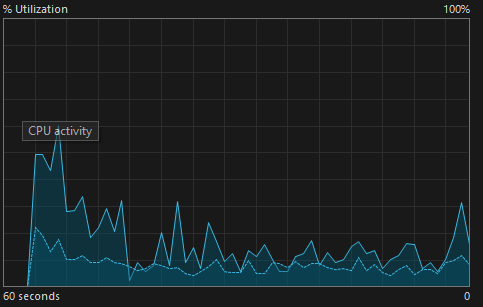
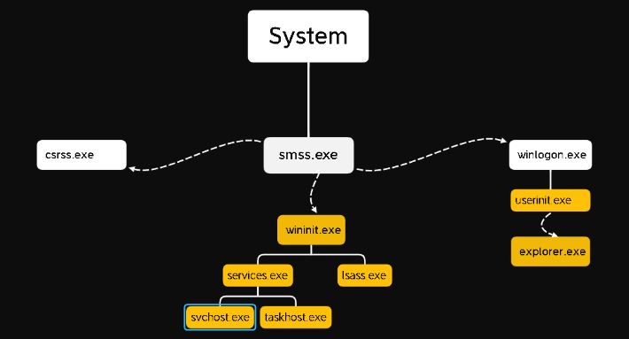

Ở hai bài viết trước, chúng ta đã cùng nhau chứng kiến cách máy tính thức giấc và giải phẫu bề mặt vật lý của ổ cứng. Bây giờ, hệ điều hành đã được nạp thành công lên RAM. Nhưng làm sao Windows có thể quản lý hàng trăm phần mềm chạy cùng lúc mà không để chúng "dẫm chân" lên nhau hay làm sập toàn bộ hệ thống?

## 1. Ranh giới sinh tử: User Mode và Kernel Mode

Để bảo vệ cốt lõi của mình, Windows chia không gian bộ nhớ và quyền thực thi lệnh thành hai thế giới song song và hoàn toàn cách biệt: User Mode (Chế độ người dùng) và Kernel Mode (Chế độ hạt nhân).

### 1.1 Kernel Mode - Vùng đất của những "Vị thần"

Kernel Mode nắm giữ "thượng phương bảo kiếm" của hệ thống.
- **Quyền hạn:** Có toàn quyền kiểm soát CPU, RAM và mọi thiết bị ngoại vi. Nó làm nhiệm vụ phân chia thời gian CPU cho các ứng dụng, quản lý bộ nhớ và điều khiển phần cứng qua các driver.
- **Không gian bộ nhớ:** Tất cả các thành phần chạy trong Kernel Mode dùng chung một vùng nhớ hệ thống duy nhất.
- **Mức độ an toàn (Sự trả giá):** Vì dùng chung bộ nhớ và có quyền cao nhất, nếu bất kỳ một đoạn mã nào ở đây (như Kernel `ntoskrnl.exe` hay một Driver card đồ họa) bị lỗi, hệ điều hành không thể tự phục hồi. Kết quả? Toàn bộ hệ thống sẽ sập, dẫn đến lỗi Màn hình xanh chết chóc (BSoD) huyền thoại.

### 1.2 User Mode - Khu cách ly an toàn

Ngược lại, User Mode là nơi cung cấp môi trường cho chúng ta làm việc, chạy giao diện và xử lý logic ứng dụng. Hầu hết mọi thứ bạn mở (Chrome, Word, các dịch vụ chạy nền) đều nằm ở đây.
- **Quyền hạn:** Cực kỳ hạn chế. Ứng dụng ở User Mode không được phép trực tiếp chạm vào phần cứng hay bộ nhớ dùng chung.
- **Không gian bộ nhớ:** Mỗi tiến trình được cấp một vùng bộ nhớ ảo biệt lập. Chrome không thể tự tiện đọc bộ nhớ của Word.
- **Mức độ an toàn:** Rất cao. Nếu một ứng dụng User Mode bị lỗi (Crash), chỉ ứng dụng đó bị đóng lại, Windows vẫn sống khỏe.

> **Câu hỏi thực chiến:** Nếu User Mode không được chạm vào phần cứng, làm sao Chrome có thể vẽ đồ họa lên màn hình hay lưu file xuống ổ cứng? 
> **Trả lời:** Ứng dụng phải "nhờ vả" Kernel thông qua một cánh cổng gọi là API (System Calls). Kernel sẽ tiếp nhận yêu cầu, kiểm tra tính hợp lệ, thay mặt ứng dụng thực thi trên CPU/phần cứng, rồi trả kết quả về.

## 2. Giám sát ranh giới bằng Task Manager

Là một người làm bảo mật, bạn hoàn toàn có thể theo dõi xem CPU đang dồn sức cho thế giới nào bằng công cụ Task Manager có sẵn của Windows.
Bạn hãy mở **Task Manager -> tab Performance -> Nhấp chuột phải vào biểu đồ CPU và chọn Show kernel times**.

Lúc này trên biểu đồ sẽ xuất hiện hai thành phần:
- **Đường nét đứt (Kernel Mode):** Cho thấy CPU đang tốn bao nhiêu % công suất để xử lý các việc "hậu cần" của hệ điều hành (quản lý bộ nhớ, điều khiển driver, xử lý ngắt...).
- **Khoảng trống giữa nét đứt và đỉnh biểu đồ (User Mode):** Đại diện cho mức tiêu thụ của các ứng dụng đang mở.

> **SOC Lưu ý:** Nếu máy tính không mở phần mềm nào nặng, nhưng đường nét đứt (Kernel Mode) lại tăng vọt bất thường, rất có thể một Driver rác hoặc một Rootkit (mã độc mức Kernel) đang âm thầm hoạt động.

## 3. Giải phẫu hệ sinh thái Tiến trình cốt lõi

Sau khi Kernel (`ntoskrnl.exe`) yên vị trên RAM, tiến trình System (PID 4) sẽ tạo ra tiến trình User-mode đầu tiên: `smss.exe` (Session Manager Subsystem). Đây chính là "ông tổ" của mọi tiến trình sau này.

Nhiệm vụ của `smss.exe` là thiết lập bộ nhớ ảo, biến môi trường và đặc biệt là chia phòng (tạo Session). Windows chia làm 2 Session chính:
- **Session 0:** Khu vực cấm địa, cách ly hoàn toàn giao diện, chỉ dành cho các dịch vụ hệ thống ngầm.
- **Session 1 (hoặc các số lớn hơn):** Dành cho người dùng đăng nhập và tương tác.

### 3.1 Trong cõi Session 0 (Hệ thống)

Tại đây, `smss.exe` gọi ra hai cận vệ trung thành:
- `csrss.exe` (Client/Server Runtime Subsystem): Xử lý các tác vụ nền cho Session 0.
- `wininit.exe` (Windows Initialize): Kẻ khởi tạo dịch vụ hệ thống. Từ `wininit.exe`, một loạt các tiến trình trọng yếu khác ra đời:
  - `services.exe`: Quản lý toàn bộ các dịch vụ (Services) của Windows. Nó khởi chạy hàng loạt các dịch vụ được bọc trong vỏ bọc `svchost.exe` (Service Host) để thực thi các DLL hệ thống.
  - `lsass.exe` (Local Security Authority Subsystem Service): Người gác đền tối cao, chịu trách nhiệm xác thực và quản lý bảo mật.

### 3.2 Trong cõi Session người dùng (Session 1+)

Khi bạn chuẩn bị đăng nhập, `smss.exe` tạo ra:
- **Một bản sao `csrss.exe` mới:** Để quản lý giao diện console cho người dùng.
- **`winlogon.exe`:** Tiến trình vẽ lên màn hình đăng nhập yêu cầu bạn nhập mật khẩu.

**Quy trình Xác thực (Authentication Flow):** Khi bạn gõ mật khẩu, `winlogon.exe` không tự kiểm tra. Nó gói thông tin đó gửi thẳng xuống cho "người gác đền" `lsass.exe` ở Session 0. `lsass.exe` sẽ đối chiếu mật khẩu. Nếu đúng, `lsass.exe` gật đầu, tạo ra một Access Token (Thẻ bài quyền lực) và cấp quyền cho phiên đăng nhập của bạn.

## 4. SOC Analytics: "Bắt thóp" mã độc ngụy trang

Hacker biết rất rõ kiến trúc này. Chúng thừa hiểu nếu chạy một file tên là `Trojan_steal_data.exe`, các nhà phân tích SOC sẽ khóa cổ chúng ngay lập tức. Vì vậy, chúng thường đổi tên mã độc thành `svchost.exe`, `lsass.exe` hay `csrss.exe`.

Vậy làm sao để SOC Analyst nhận diện được kẻ giả mạo? Chúng ta dựa vào **Mối quan hệ Cha - Con (Parent-Child Process)** và **Vị trí file**.

- **Quy luật 1:** `lsass.exe` xịn chỉ có một bản duy nhất đang chạy, vị trí file bắt buộc phải ở `C:\Windows\System32\`, và tiến trình cha bắt buộc phải là `wininit.exe`. Nếu bạn thấy `lsass.exe` mọc ra từ `explorer.exe` (nghĩa là do người dùng click chuột mở lên) hoặc nằm ở thư mục `C:\Temp\`, đó 100% là Malware.
- **Quy luật 2:** `svchost.exe` có thể có hàng chục bản đang chạy (để chứa các dịch vụ khác nhau). Nhưng tất cả chúng đều phải có tiến trình cha là `services.exe`. Mã độc thường sinh ra `svchost.exe` độc lập để đánh lừa mắt người.

**Mục tiêu số 1 - `lsass.exe`:** Vì tiến trình này làm nhiệm vụ đối chiếu và lưu trữ thông tin đăng nhập, nó giữ rất nhiều mật khẩu (đôi khi là mật khẩu chưa mã hóa) trong RAM của nó. Các công cụ tấn công khét tiếng như Mimikatz luôn tìm cách can thiệp vào bộ nhớ của `lsass.exe` để trích xuất (dump) mật khẩu của quản trị viên.

---

*Kiến trúc tiến trình của Windows là một cỗ máy vận hành hoàn hảo với ranh giới quyền lực khắt khe. Việc hiểu rõ ai gọi ai, ai làm nhiệm vụ gì là kỹ năng sống còn giúp SOC Analyst nhạy bén trước các kỹ thuật ẩn mình (Evasion) của Malware. Trong bài viết tiếp theo, chúng ta sẽ rời khỏi RAM để đi sâu vào các ngóc ngách của ổ cứng: Khám phá hệ thống tệp NTFS và kỹ thuật giấu mã độc bằng Alternate Data Streams. Đừng bỏ lỡ nhé!*
